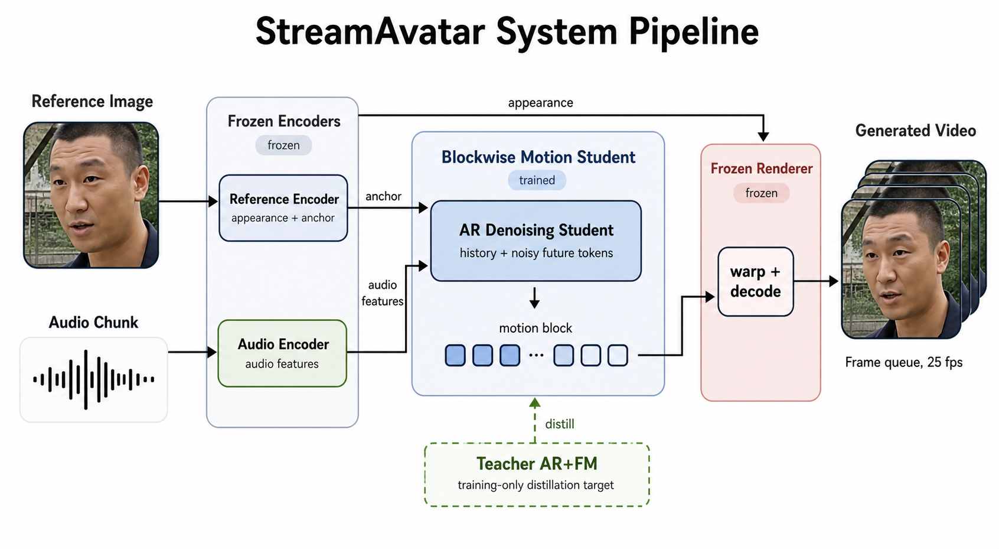

# StreamAvatar / AROD

StreamAvatar is an audio-driven portrait animation project built on DyStream. The frozen DyStream teacher provides the reference audio and rendering stack, while our main model is **AROD**: an **Autoregressive One-step Denoising** student that predicts short future motion blocks much faster than the original teacher rollout.


## Architecture



AROD keeps the autoregressive block rollout structure, but replaces the teacher's sequential AR+FM motion generation with one student forward pass per short future block:

```text
reference image + driving audio
  -> frozen DyStream audio encoder
  -> AROD blockwise motion student
  -> frozen DyStream/LIA renderer
  -> talking-head video
```

The current app is an offline Gradio demo: upload or select a reference face image and an audio file, then generate the full output video. The model design is streaming-capable, but this repository does not claim to provide a fully optimized live video-call application.

## Repository Layout

- `app.py`: AROD Gradio demo.
- `run.sh`: one-command launcher for the demo.
- `benchmark_arod_speed.py`: motion-only teacher vs AROD speed benchmark.
- `verify_blockwise_distill.py`: end-to-end teacher/student comparison with rendered videos.
- `train_blockwise_distill.py`: AROD training code and rollout helpers.
- `configs/distill/`: AROD distillation configs.
- `img_files/person1.png`, `img_files/person1.npz`: default reference image and cached reference motion latent.
- `wav_files/test_audio_60s.wav`, `wav_files/test_audio_3s.wav`: default driving audio samples.
- `tools/visualization_0416/`: renderer code and config. The large renderer checkpoint is downloaded separately.
- `report/`: report source, PDF, and figures.
- `proposal/`: proposal source and PDF.

Large checkpoints, training caches, generated outputs, and virtual environments are not stored in git.

## Requirements

Recommended setup:

- Linux
- Python 3.10 or 3.11
- CUDA-capable GPU
- `ffmpeg` available on `PATH`
- Git LFS or a separate artifact download method for large checkpoints

Install `ffmpeg` if needed:

```bash
sudo apt-get update
sudo apt-get install -y ffmpeg
```

## Environment Setup

Clone the repository:

```bash
git clone https://github.com/CXP-2024/StreamAvatar.git
cd StreamAvatar
```

Create and activate a Python environment:

```bash
python -m venv .venv
source .venv/bin/activate
python -m pip install --upgrade pip
pip install -r requirements.txt
```

The renderer and audio stack use local files, so keep all model assets under the repository root using the paths below.

## Model Assets

The demo expects four asset groups. Keep the filenames and directories exactly as shown.

```text
StreamAvatar/
  checkpoints/
    last.ckpt
  pretrained_model/
    wav2vec2-base-960h/
      config.json
      preprocessor_config.json
      pytorch_model.bin
      ...
  tools/
    pretrained_model/
      epoch=0-step=312000.ckpt
  outputs/
    blockwise_stream_distill_cross_fm_teacher_cache_anchor_pretrain_60k/
      blockwise_latest.pt
```

You can use the helper script for the public base assets:

```bash
bash scripts/download_assets.sh
```

By default, the script downloads Wav2Vec2, tries to fetch the original DyStream assets from `robinwitch/DyStream`, downloads the AROD checkpoint from the public Hugging Face repo `pancx/StreamAvatar-AROD`, and verifies the AROD checkpoint SHA256.

If you want to use the Google Drive mirror instead, set `AROD_DOWNLOAD_SOURCE=gdrive`. If your network needs a SOCKS proxy, pass it to `gdown`:

```bash
AROD_DOWNLOAD_SOURCE=gdrive \
AROD_GDOWN_PROXY=socks5h://127.0.0.1:7891 \
bash scripts/download_assets.sh
```

The Google Drive file is kept as a mirror; Hugging Face is now the default public checkpoint host.

### 1. DyStream Teacher Checkpoint

Place the original DyStream motion teacher checkpoint here:

```text
checkpoints/last.ckpt
```

If you download the original DyStream assets as an archive, copy or move its teacher checkpoint into `checkpoints/last.ckpt`.

### 2. Wav2Vec2 Audio Encoder

Download the Hugging Face Wav2Vec2 base model into `pretrained_model/wav2vec2-base-960h` if you are not using `scripts/download_assets.sh`:

```bash
mkdir -p pretrained_model
huggingface-cli download facebook/wav2vec2-base-960h \
  --local-dir pretrained_model/wav2vec2-base-960h \
  --local-dir-use-symlinks False
```

### 3. DyStream/LIA Renderer Checkpoint

The renderer code is included in `tools/visualization_0416`, but the large renderer checkpoint is not. Place it here:

```text
tools/pretrained_model/epoch=0-step=312000.ckpt
```

This path matches `tools/visualization_0416/configs/head_animator_best_0506.yaml`.

### 4. AROD Student Checkpoint

Download the StreamAvatar AROD real-anchor student checkpoint from Hugging Face:

```bash
pip install huggingface-hub
mkdir -p outputs/blockwise_stream_distill_cross_fm_teacher_cache_anchor_pretrain_60k
huggingface-cli download pancx/StreamAvatar-AROD blockwise_latest.pt \
  --local-dir outputs/blockwise_stream_distill_cross_fm_teacher_cache_anchor_pretrain_60k
```

Google Drive mirror:

```bash
pip install gdown
mkdir -p outputs/blockwise_stream_distill_cross_fm_teacher_cache_anchor_pretrain_60k
gdown "1El-2l5GZRfrVLEl2-x6ocPyyT9ILxDJS" \
  -O outputs/blockwise_stream_distill_cross_fm_teacher_cache_anchor_pretrain_60k/blockwise_latest.pt
```

For networks that require a SOCKS proxy, use:

```bash
gdown --proxy socks5h://127.0.0.1:7891 \
  "1El-2l5GZRfrVLEl2-x6ocPyyT9ILxDJS" \
  -O outputs/blockwise_stream_distill_cross_fm_teacher_cache_anchor_pretrain_60k/blockwise_latest.pt
```

The expected SHA256 is:

```text
01893fabb842fcc8e9817a8e2530108d75932aad4f6ac4136e5c22b94702e860
```

`app.py` will also accept `blockwise_best_val.pt`, `blockwise_best.pt`, or `blockwise_last.pt` in the same directory if `blockwise_latest.pt` is not present.

## One-Command Demo

After installing dependencies and placing the model assets, launch the demo:

```bash
bash run.sh
```

Open:

```text
http://localhost:7860
```

To choose a different port:

```bash
PORT=7861 bash run.sh
```

The built-in sample uses:

- `img_files/person1.png`
- `img_files/person1.npz`
- `wav_files/test_audio_60s.wav`
- `configs/distill/blockwise_stream_distill_cross_fm_teacher_cache_anchor_pretrain_60k.yaml`

## Manual Launch

```bash
source .venv/bin/activate
python -u app.py --host 0.0.0.0 --port 7860
```

## Verify Teacher vs AROD

Run the end-to-end verification suite:

```bash
source .venv/bin/activate
python verify_blockwise_distill.py \
  --img-path img_files/person1.png \
  --audio-path wav_files/test_audio_60s.wav \
  --train-sample-idx 0
```

Outputs are written under:

```text
outputs/verify_blockwise_stream_distill_cross_fm_teacher_cache_anchor_pretrain_60k_suite/
```

The important metrics are:

- `teacher_time_sec`: frozen DyStream teacher motion rollout time.
- `student_time_sec`: AROD student motion rollout time.
- `speedup`: teacher motion time divided by student motion time.
- `comparison_video`: rendered teacher/student comparison.

Fresh verification on a 60-second sample produced:

```text
teacher_time_sec: 29.384
student_time_sec: 3.752
speedup: 7.83x
```

Earlier verification of the same config/output suite recorded `10.24x`. We describe the result as approximately `8x` in the latest fresh run and capable of reaching about `10x` under the same setup, not as a fixed deterministic 10x on every run.

## Motion-Only Speed Benchmark

For a faster timing-only check without rendering videos:

```bash
source .venv/bin/activate
python benchmark_arod_speed.py \
  --config configs/distill/blockwise_stream_distill_cross_fm_teacher_cache_anchor_pretrain_60k.yaml \
  --img-path img_files/person1.png \
  --audio-path wav_files/test_audio_60s.wav \
  --output outputs/arod_speed_benchmark.json
```

Fresh motion-only timing on the same 60-second sample produced:

```text
teacher_motion_time_sec: 26.007
student_motion_time_sec: 3.253
motion_speedup: 8.00x
```

This benchmark excludes rendering and audio muxing. It measures only the part AROD replaces: DyStream teacher motion rollout.

## Build the Report and Proposal

```bash
./report/build.sh
./proposal/build.sh
```

Outputs:

```text
report/StreamAvatar_report.pdf
proposal/StreamAvatar_proposal.pdf
```

## Notes

- Do not commit large checkpoints or generated `outputs/` directories.
- Keep model paths relative to the repository root.
- The default app config is `configs/distill/blockwise_stream_distill_cross_fm_teacher_cache_anchor_pretrain_60k.yaml`.
- AROD is a blockwise autoregressive denoising model, not a conventional flow-only model and not a standard token-by-token GPT decoder.
